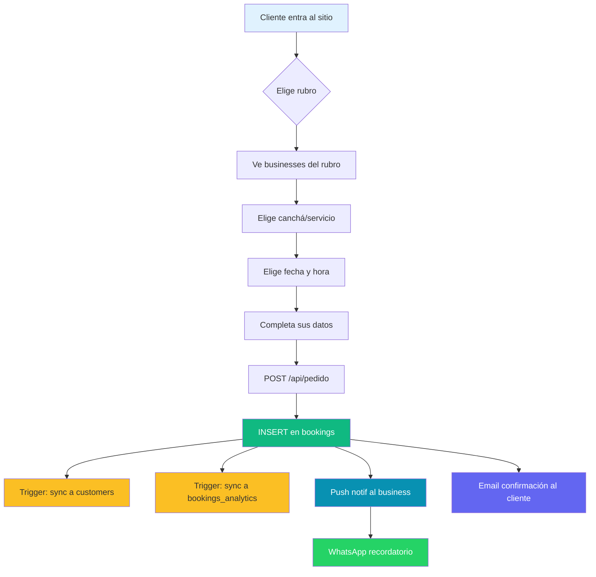

# TurnitosLR — Modelo de Base de Datos

Diagrama de las tablas de Postgres (Supabase) que componen la app TurnitosLR, sus relaciones y los puntos críticos a tener en cuenta.

> **Auditado el 2026-07-10.** Algunas observaciones están marcadas con 🔒 (revisar seguridad antes de producción).

## Diagrama ER

```mermaid
erDiagram
    businesses ||--o{ resources : "tiene"
    businesses ||--o{ bookings : "recibe"
    businesses ||--o{ subscriptions : "tiene"
    businesses ||--o{ business_subcategories : "etiquetada"
    businesses }o--|| categories : "pertenece"
    businesses }o--o| subcategories : "principal"
    businesses }o--|| subscription_plans : "usa"
    businesses }o--o| sellers : "referida por"
    businesses ||--o{ subscription_payments : "paga"
    businesses ||--o{ push_subscriptions : "suscripta"
    businesses ||--o{ business_amenities : "ofrece"
    businesses ||--o{ customers : "tiene"
    businesses ||--|| locations : "geoubicada"

    resources }o--|| specialists : "atendida por"
    resources }o--o{ bookings : "asignada a"

    bookings }o--|| resources : "usa"
    bookings }o--|| customers : "de"
    bookings ||--o| bookings_analytics : "agregada a"

    customers ||--o{ bookings : "realiza"

    categories ||--o{ subcategories : "tiene"
    categories ||--o{ business_subcategories : "agrupa"
    categories ||--o{ businesses : "categoriza"

    sellers ||--o{ businesses : "refiere"
    sellers ||--o{ seller_commissions : "gana"

    seller_commissions }o--|| subscription_payments : "calculada sobre"

    subscription_plans ||--o{ subscriptions : "asignado a"
    subscription_plans ||--o{ subscription_payments : "pagado por"

    amenities ||--o{ business_amenities : "asignado a"

    super_admins ||--o{ audit_log : "registra"

    businesses {
        text id PK "TEXT, no UUID"
        text slug UK "auto-generado, NOT NULL"
        text name "NOT NULL"
        text type "CHECK: sport|service|alquiler"
        text email UK "login"
        text password "🔒 plaintext!"
        boolean password_changed "default false"
        text logo_url
        text banner_url
        text theme "default light"
        text primary_color "default #3b82f6"
        numeric rating "default 0"
        text_array amenities "duplicado con business_amenities"
        jsonb gallery_highlights
        jsonb payment_settings "bank info"
        jsonb booking_rules
        jsonb pricing_tiers
        jsonb metadata
        text pricing_model "CHECK: hourly|daily"
        numeric price_per_hour
        numeric price_per_day
        text subscription_status "CHECK: trial|active|inactive|cancelled"
        timestamptz trial_start_date
        timestamptz trial_end_date
        text seller_id FK "TEXT"
        boolean is_admin
    }

    resources {
        uuid id PK
        text business_id FK "TEXT"
        text type "court|service|venue|additional"
        text name
        numeric base_price
        integer max_capacity "default 1"
        integer buffer_minutes "default 15"
        boolean active
    }

    specialists {
        uuid id PK
        text business_id FK
        text name
        text specialty
        boolean active
    }

    bookings {
        uuid id PK
        text business_id FK
        uuid resource_id FK
        uuid specialist_id FK
        text customer_name
        text customer_email
        text customer_phone
        timestamptz start_time
        timestamptz end_time
        integer duration
        numeric price
        text status "pending|confirmed|deposit_paid|completed|cancelled"
        text payment_method
        numeric deposit_amount
        timestamptz confirmed_at
        timestamptz cancelled_at
        timestamptz completed_at
        timestamptz deposit_paid_at
        timestamptz created_at
        text cancellation_reason
        jsonb history
        jsonb metadata
    }

    bookings_analytics {
        uuid id PK
        uuid booking_id FK UK
        date booking_date
        text business_id
        numeric revenue
        text resource_type
    }

    customers {
        uuid id PK
        text business_id FK
        text name "NOT NULL"
        text phone "NOT NULL"
        text notes
        jsonb tags
        timestamptz created_at
        timestamptz updated_at
    }

    categories {
        uuid id PK
        text name "Deportes|Belleza|Salud|Quinchos|Mascotas"
    }

    subcategories {
        uuid id PK
        uuid category_id FK
        text name
    }

    business_subcategories {
        uuid id PK
        text business_id FK
        uuid subcategory_id FK
    }

    subscription_plans {
        uuid id PK
        text name "Free|Pro|Business"
        numeric price
        numeric max_bookings_per_month "Free=50, Pro=∞"
        boolean mp_enabled
    }

    subscriptions {
        uuid id PK
        text business_id FK
        uuid subscription_plan_id FK
        timestamptz start_date
        timestamptz end_date
        text status "active|cancelled|expired"
    }

    subscription_payments {
        text id PK
        text business_id FK
        uuid subscription_plan_id FK
        numeric amount
        numeric original_amount
        numeric discount_percentage
        text payment_cycle "monthly|quarterly"
        integer months_covered
        text status "pending|completed|failed|refunded"
        timestamptz payment_date
        timestamptz period_start
        timestamptz period_end
    }

    sellers {
        text id PK
        text email UK "🔒 plaintext!"
        text password "🔒 plaintext!"
        text first_name
        text last_name
        text phone
        boolean is_active
    }

    seller_commissions {
        text id PK
        text seller_id FK
        text business_id FK
        text payment_id FK
        integer subscription_month "1-6"
        numeric base_commission_rate "30→20→10"
        numeric total_commission_rate
        numeric commission_amount
        numeric payment_amount
        integer period_month
        integer period_year
        integer active_clients_count
    }

    super_admins {
        text id PK
        text email UK "🔒 plaintext!"
        text password "🔒 plaintext!"
        text first_name
        text last_name
        boolean is_active
    }

    amenities {
        uuid id PK
        text name
        text icon
    }

    business_amenities {
        uuid id PK
        uuid amenity_id FK
        text business_id FK
    }

    push_subscriptions {
        uuid id PK
        text business_id FK
        text token "FCM token"
        text device_type "web|android|ios"
        timestamptz last_updated
    }

    locations {
        text business_id PK FK
        numeric latitude
        numeric longitude
        geography location_point "PostGIS Point(4326)"
        text address
        text city
    }
```

## 🔒 Puntos críticos (revisar antes de producción)

| # | Tabla(s) | Problema | Severidad |
|---|---|---|---|
| 1 | `businesses`, `sellers`, `super_admins` | Passwords en **texto plano** | 🔴 Crítico |
| 2 | `businesses`, `bookings`, `customers`, `resources` | **RLS deshabilitado** — anon key puede leer todo | 🔴 Crítico |
| 3 | `businesses` | Mezcla `category_id` (FK simple) con `business_subcategories` (N:M) — datos pueden divergir | 🟡 Medio |
| 4 | `businesses` | Mezcla `latitude/longitude` con `location_point` (PostGIS) — denormalizado | 🟡 Medio |
| 5 | `businesses` | Columna `amenities` (TEXT[]) duplica `business_amenities` (N:M) | 🟡 Medio |
| 6 | `businesses.id` y `sellers.id` | Son `TEXT`, no `UUID` — inconsistente con el resto | 🟡 Medio |
| 7 | `bookings` | El trigger de sync a `customers` puede crear duplicados en casos de borde | 🟢 Menor |
| 8 | `seller_commissions` | No tiene UNIQUE constraint que evite duplicados por (seller_id, payment_id, month) | 🟢 Menor |

## Flujos de datos principales



## Versión y cambios

- **2026-07-10** — diagrama inicial generado por Victoria, basado en auditoría del código
- Próximos: agregar índice de columnas, links a documentación, tags por severidad